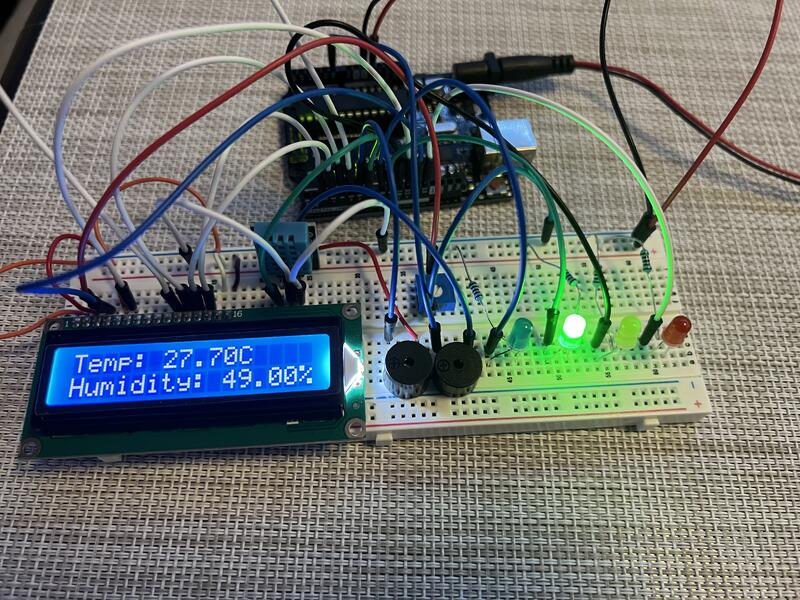
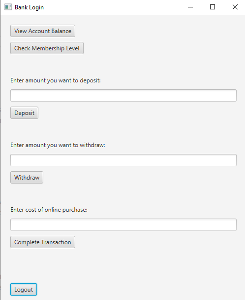
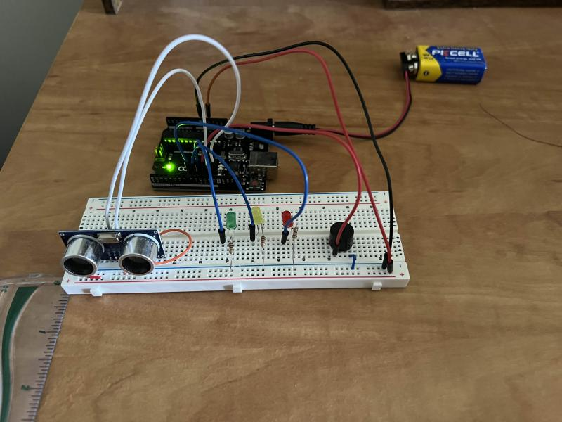

# Computer Engineering Student @ Toronto Metropolitan University

## Projects

### Chatbot Application

**Technologies Used**: _JavaScript, HTML/CSS, Node.js, Express.js, OpenAI API_

Developed a full-stack chatbox application that integrates with the OpenAI API to simulate interactive conversations. The application features dynamic user and bot interactions, with real-time response animations that mimic typing behavior. The project focuses on enhancing user engagement through responsive design and smooth asynchronous operations. 

**Demo Video:**

  
     
    
### Interactive Temperature and Humidity Display

**Technologies Used**: _Arduino IDE_

Designed and implemented an Arduino-based temperature and humidity monitoring system with real-time data display on an LCD. The system uses a DHT11 sensor to track conditions, triggering different LEDs and buzzers at specific temperature thresholds: a blue LED for temperatures below 25°C, a green LED for 25°C to 30°C, a yellow LED for 30°C to 35°C with an active buzzer, and a red LED above 35°C accompanied by both active and passive buzzers. The project provided accurate real-time monitoring and clear visual and audio feedback for various temperature levels.  

**Demo Video:**

  
     
    
### Bank Account Application
 

**Technologies Used**: _JavaFX, Java, Graphical User Interface (GUI)_

Developed a Bank Account Application designed for both Managers and Customers, featuring tiered privileges based on account balance and secure data management. The application includes key banking functionalities such as authentication, transaction management, and account balance tracking, with distinct benefits for different privilege levels. Secure authentication protocols and role-based access management were implemented to ensure data security and efficient account administration, resulting in a robust, user-friendly application for banking operations.  

**Demo Video:**

  
     
    
### Simple General-Purpose Processor

**Technologies Used**: _VHDL, Field-Programmable Gate Arrays (FPGA)_

Collaborated with a team and designed a Simple Processor using VHDL on an FPGA board. The processor comprised four key components: a Storage Unit with 8-bit registers, an ALU core, a Control Unit with a Finite State Machine (FSM) and a 4:16 decoder, and Seven Segment Display units. The microcoded ALU output was displayed on the Seven Segment Display, providing a visual representation of the results. The project demonstrated the effective integration of VHDL components, resulting in a functional processor with clear visual feedback.

### Prototype Ultrasonic Distance Sensor with LED and Buzzer Alert System

**Technologies Used**: _Arduino IDE_

Developed a hands-on electronics project that features a prototype Ultrasonic Distance Sensor with a real-time LED and Buzzer Alert System using Arduino. The system detects objects within a 1-foot range, activating corresponding LEDs to indicate proximity. A green LED lights up within 12 inches, a yellow LED within 8 inches, and a red LED with an audible buzzer within 4 inches. The project incorporated a smoothing algorithm to average sensor readings, reducing noise and preventing false triggers, resulting in a responsive and accurate alert system.  

**Demo Video:**

  
     
    
## Work Experience
**Sales Associate @ Dollar Tree (_July 2021 - Aug 2024_)**
- Processed over 150 sales transactions daily with 99.9% accuracy, resulting in a seamless customer checkout experience and increased revenue by 15%.
- Maintained optimal store display by restocking shelves with inventory worth $2500 weekly, resulting in a visually appealing environment t
- Assisted in conducting weekly inventory checks, identifying discrepancies worth $1000 and promptly reporting them to management for timely restocking, ensuring adequate stock levels for customer demands

**Electrical Sub Team @ Toronto Met BAJA Racing (_Sep - Nov 2023_)**
- Collaborated with a team to develop a prototype ultrasonic distance sensor system with 3 LED indicators and a buzzer, enhancing obstacle detection within 12 inches for real-time driver alerts
- Designed and tested an embedded system using an Arduino, achieving accurate obstacle detection within a 1-foot range, improving detection reliability by 30%
- Implemented a smoothing algorithm in C++, reducing false triggers by 50% and improving system reliability

## Education
**BEng in Computer Engineering** | Toronto Metropolitan University (Exp. 2027) 

#### Technical Skills: 
- **Languages:** C, C++, Java, JavaScript, HTML/CSS, VHDL 
- **Tools:** MATLAB, Git, SQL, Multisim, Altera Quartus II, Node.js, Express.js, API integration
- **Hardware:** Soldering, Breadboard Wiring, Oscilloscopes, Multimeters, Arduino, Microcontrollers

